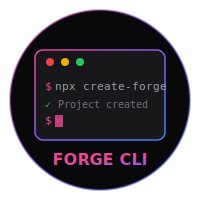

# Forge CLI

<p align="center">
  
</p>

<p align="center">
  <strong>Create and manage ForgeStack projects with ease</strong>
</p>

<p align="center">
  <a href="https://www.npmjs.com/package/create-forge"></a>
  <a href="https://www.npmjs.com/package/create-forge"></a>
  <a href="LICENSE"></a>
</p>

---

## Quick Start

```bash
# With npx
npx create-forge my-app

# With pnpm
pnpm create forge my-app

# With yarn
yarn create forge my-app

# With bun
bunx create-forge my-app
```

## Features

- **CSS Framework Choice** - AeroCraft vs Tailwind with comparison table
- **Comparison Tables** - Beautiful terminal tables showing ForgeStack vs alternatives
- **Multiple Templates** - React, Server, Full-Stack monorepo
- **Select All Packages** - One-click to include all ForgeStack packages
- **AeroCraft** - CSS utility framework with 25+ component recipes, runtime theming
- **Bear UI Integration** - 50+ components, AeroCraft-powered, customizable themes
- **Synapse State** - Powerful state management with "nuclear" folder structure
- **Forge Compass** - Type-safe routing with guards (vs React Router comparison)
- **Forge Form** - Advanced form management with validation
- **Forge Query** - Data fetching with auto caching, retry, optimistic updates
- **Grid Table** - Headless data grid, drag columns, mobile-ready (replaces AG Grid)
- **Relay** - Zero-dependency HTTP client with WebSocket support
- **Forge Auth** - Authentication & OAuth (Google, Facebook, GitHub)
- **Lingo** - AI-powered translations & localization (replaces i18next)
- **Rail** - Modular carousel & slider, touch-ready, accessible (replaces Swiper)
- **Torch** - Media player: video, audio, reels & ads with analytics (replaces Video.js)
- **Kiln** - Component documentation & showcase (replaces Storybook)
- **Crucible** - Full-stack testing framework (client & server)
- **Anvil Utils** - Common utilities and hooks
- **Harbor Backend** - Complete Node.js framework (MongoDB, JWT, WebSocket, Scheduling)
- **Multiple Package Managers** - npm, pnpm, yarn, bun
- **Docker Support** - Production-ready Dockerfile and docker-compose
- **Code Generators** - Generate pages, components, and slices

## Commands

### Create a New Project

```bash
forge create [project-name]

# Options:
#   -t, --template <template>       Project template (react, server, fullstack)
#   -p, --package-manager <pm>      Package manager (npm, pnpm, yarn, bun)
#   -o, --out-dir <path>            Output directory
#   -y, --yes                       Skip prompts and use defaults
```

### Add ForgeStack Packages

```bash
forge add [package]

# Available packages:
#   bear          - UI Component Library (AeroCraft-powered)
#   aerocraft     - CSS Utility Framework (Tailwind alternative)
#   grid-table    - Data Grid (replaces AG Grid)
#   forge-query   - Data Fetching (replaces TanStack Query)
#   forge-form    - Form Management
#   forge-compass - Routing (replaces React Router)
#   synapse       - State Management (replaces Redux)
#   anvil         - Utilities & Hooks
#   harbor        - Backend Framework
#   lingo         - Translation & Localization (replaces i18next)
#   rail          - Carousel & Slider (replaces Swiper)
#   torch         - Media Player (replaces Video.js)
#   kiln          - Component Docs (replaces Storybook)
#   relay         - HTTP Client & WebSockets
#   forge-auth    - Authentication & OAuth
#   crucible      - Testing Framework (client & server)

# Options:
#   -c, --color <hex>               Bear UI primary color
#   -s, --scope <scope>             Crucible scope (client, server, both)
```

### Generate Synapse Nuclear Slice

```bash
forge nuclear [slice-name]

# Options:
#   -p, --path <path>               Base path (default: src)
```

## Templates

### React (`react`)
- Vite + React 18 + TypeScript
- Bear UI with theme customization
- Forge Compass routing
- Synapse state with nuclear structure
- Anvil utilities
- Grid Table for data display
- API layer with Synapse hooks

### Server Only (`server`)

Choose between two server frameworks:

| Framework | Description |
|-----------|-------------|
| **Harbor** | ForgeStack's complete backend framework (recommended) |
| Express | Standard Express.js setup |

**Harbor includes:**
- Zero-config server (Express under the hood)
- MongoDB ODM (optional)
- JWT authentication ready
- Built-in validation
- Rate limiting & caching
- Health checks & metrics

### Full-Stack Monorepo (`fullstack`)
- Workspace-based monorepo
- Client with React + Vite
- Server with **Harbor** or Express

## Project Structure

```
src/
├── api/                # API client & hooks
├── components/         # UI components
│   ├── Layout/
│   └── common/
├── config/             # App configuration
├── pages/              # Page components
│   └── Home/
│       ├── Home.tsx
│       ├── Home.types.ts
│       └── index.ts
├── types/              # TypeScript types
└── nuclear/            # Synapse state (if enabled)
    ├── config/
    └── slices/
        └── app/
            ├── app.nucleus.ts
            ├── app.hooks.ts
            └── index.ts
```

## Generated Scripts

```bash
# Start development server
npm run dev

# Build for production
npm run build

# Generate new page
npm run generate:page

# Generate new component
npm run generate:component

# Generate Synapse slice
npm run generate:slice

# Docker
npm run docker:build
npm run docker:compose
```

## Examples

### Create with All Options

```bash
npx create-forge my-app --template react --package-manager pnpm --yes
```

### Custom Output Directory

```bash
npx create-forge my-app --out-dir ./projects/my-app
```

### Add Packages to Existing Project

```bash
cd my-project
npx forge add bear --color "#3b82f6"
npx forge add aerocraft
npx forge add synapse
npx forge add relay
npx forge add forge-auth
npx forge add lingo
npx forge add rail
npx forge add torch
npx forge add kiln
npx forge add crucible --scope both
npx forge nuclear user
npx forge nuclear cart
```

## ForgeStack Packages

| Package | Version | Description | Replaces |
|---------|---------|-------------|----------|
| `@forgedevstack/bear` | `^1.2.2` | UI Component Library | — |
| `@forgedevstack/aerocraft` | `^1.0.4` | CSS Utility Framework | Tailwind |
| `@forgedevstack/synapse` | `^1.0.2` | State Management | Redux, Zustand |
| `@forgedevstack/forge-compass` | `^1.0.2` | Routing | React Router |
| `@forgedevstack/forge-form` | `^1.0.0` | Form Management | Formik, React Hook Form |
| `@forgedevstack/forge-query` | `^1.0.1` | Data Fetching | TanStack Query, SWR |
| `@forgedevstack/grid-table` | `^1.0.8` | Data Grid | AG Grid, TanStack Table |
| `@forgedevstack/relay` | `^1.0.0` | HTTP Client & WebSockets | Axios |
| `@forgedevstack/forge-auth` | `^1.0.0` | Authentication & OAuth | — |
| `@forgedevstack/lingo` | `^1.0.0` | Translation & Localization | i18next, react-intl |
| `@forgedevstack/rail` | `^1.0.0` | Carousel & Slider | Swiper, Embla |
| `@forgedevstack/torch` | `^1.0.0` | Media Player | Video.js, Plyr |
| `@forgedevstack/kiln` | `^1.0.5` | Component Docs & Showcase | Storybook |
| `@forgedevstack/crucible` | `^1.0.0` | Testing Framework | Jest, Vitest |
| `@forgedevstack/anvil` | `^1.0.6` | Utilities & Hooks | Lodash |
| `@forgedevstack/harbor` | `^1.6.2` | Backend Framework | Express (raw) |

## Documentation

- [ForgeStack](https://forgedevstack.com)
- [AeroCraft](https://forgedevstack.com/aerocraft)
- [Bear UI](https://forgedevstack.com/bear)
- [Synapse](https://forgedevstack.com/synapse)
- [Forge Compass](https://forgedevstack.com/compass)
- [Grid Table](https://forgedevstack.com/table)
- [Relay](https://forgedevstack.com/relay)
- [Forge Auth](https://forgedevstack.com/auth)
- [Lingo](https://forgedevstack.com/lingo)
- [Rail](https://forgedevstack.com/rail)
- [Torch](https://forgedevstack.com/torch)
- [Kiln](https://forgedevstack.com/kiln)
- [Crucible](https://forgedevstack.com/crucible)
- [Anvil](https://forgedevstack.com/anvil)
- [**Harbor**](https://forgedevstack.com/harbor)

## Changelog

See [CHANGELOG.md](./CHANGELOG.md) for release history.

## License

MIT © [ForgeStack](https://forgedevstack.com)
